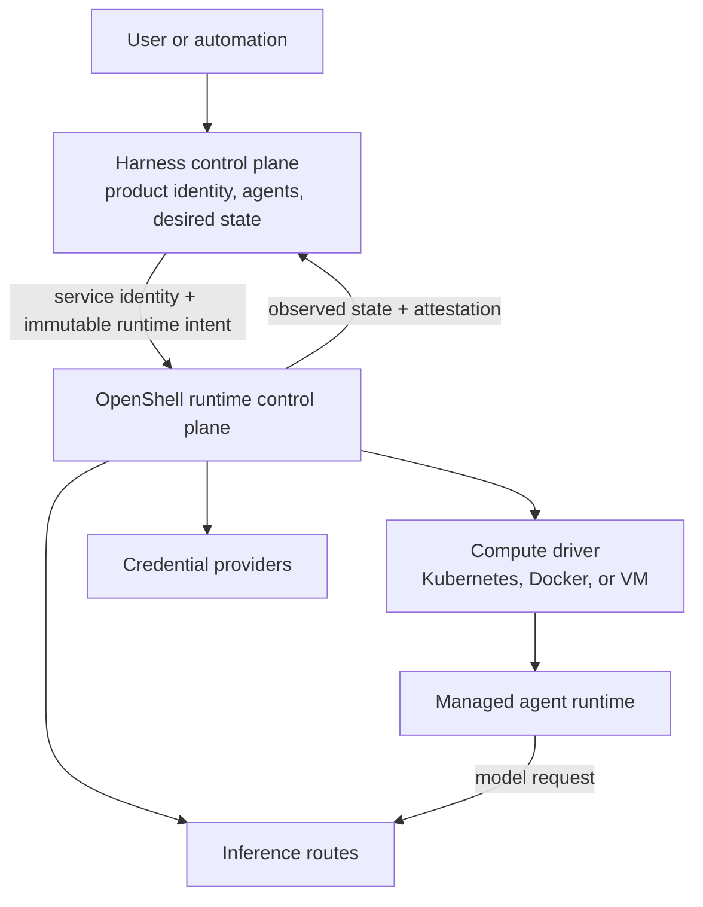
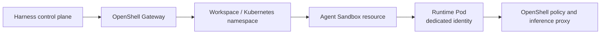

---
authors:
  - "@sallyom"
state: draft
links:
  - https://github.com/NVIDIA/OpenShell/pull/1980
  - https://github.com/NVIDIA/OpenShell/issues/1678
---

# RFC XXXX - External Harness Runtime Control Plane

> This is a provisional review draft. OpenShell maintainers assign RFC numbers
> from an originating issue. Replace `XXXX` and add that issue as the first
> metadata link before opening an RFC pull request.

## Summary

OpenShell should define an open, harness-agnostic runtime control-plane contract
and ship its reference implementation. An external harness control plane, such
as the OpenClaw Controller (OCC), would retain ownership of its users, product
resources, desired agent state, and product authorization. It would consume
OpenShell runtime APIs to create isolated workspaces, reconcile agent runtimes,
bind credentials and inference routes, apply runtime policy, and obtain
readiness and enforcement evidence. The contract is implementation-neutral
enough that another runtime control plane could conform without reproducing
OpenShell internals.

This establishes two supported authority modes over the same OpenShell runtime
core. Standalone OpenShell remains authoritative for resources created by its
users and CLI. In harness-managed mode, OpenShell is authoritative for runtime
resources and observed runtime state, while the registered harness is
authoritative for the product intent from which those resources are derived.
OpenShell does not become specific to OpenClaw, and OCC does not become an
implementation of OpenShell.

## Motivation

OpenShell already provides much of the runtime machinery that enterprise agent
platforms need: sandbox lifecycle, workload isolation, policy enforcement,
provider credential handling, inference routing, and Kubernetes and local
compute drivers. An agent harness can use those capabilities today through the
CLI, but the CLI and current user-oriented API do not define a durable contract
between two reconciling control planes.

[RFC-0011](https://github.com/NVIDIA/OpenShell/pull/1980) proposes the
multi-player foundation: workspaces as isolation boundaries, workload
identity, workspace-scoped providers and policies, quotas, audit attribution,
and managed or operator-controlled Kubernetes namespace mapping. Those
capabilities are necessary, but a workspace API alone does not answer which
system owns agent desired state, how a harness retries an uncertain operation,
how an immutable runtime generation is activated, or how OpenShell proves that
the requested policy and credential bindings are in force.

Without a harness contract, each integration must choose between undesirable
options:

- drive the OpenShell CLI as an implicit service API;
- duplicate OpenShell's sandbox, credential, policy, and inference machinery;
- let both the harness and OpenShell reconcile the same Kubernetes workload;
- forward end-user identity or credentials into the runtime plane; or
- deploy one complete OpenShell installation for every product tenant.

[Issue #1678](https://github.com/NVIDIA/OpenShell/issues/1678) describes a
related platform-managed Kubernetes model in which an external platform owns
namespaces, final policy, secret references, placement, and cleanup while
OpenShell executes sandboxes. That model remains useful for platforms that
already own those runtime concerns. This RFC proposes a different, complementary
mode: an external harness owns product intent while OpenShell remains the
runtime control plane and the sole reconciler of OpenShell-managed runtime
resources.

## Non-goals

- Defining OpenClaw resources, OCC APIs, or an OpenClaw-specific user
  experience in OpenShell.
- Replacing the standalone OpenShell CLI or requiring every deployment to have
  an external harness.
- Making OpenShell authoritative for an external harness's users, product IAM,
  agent definitions, conversations, channels, plugins, or product audit log.
- Letting two control planes write the same sandbox, Pod, provider binding, or
  runtime policy object.
- Passing human browser sessions, OAuth bearer tokens, or raw provider
  credentials between control planes.
- Standardizing every harness's agent lifecycle. The contract defines runtime
  generations and operations, not product concepts such as drafts, releases,
  conversations, or agent revisions.
- Declaring OpenShell a formal industry standard or creating a separate
  standards organization before independent implementations exist.
- Requiring issue #1678 to be implemented before this contract. Shared
  Kubernetes primitives may be reused, but the authority modes are distinct.

## Proposal

### Control-plane boundary

OpenShell becomes the runtime control plane beneath one or more registered
harness control planes.



Authority is divided as follows:

| Authority | Harness control plane | OpenShell | Platform operator |
| --- | --- | --- | --- |
| Product users, roles, and tenant admission | Authoritative | Not represented | Configures trust roots |
| Agent definitions and desired lifecycle | Authoritative | Receives immutable runtime intent | No product authority |
| Runtime workspace and sandbox lifecycle | Requests and correlates | Authoritative | Sets installation ceilings |
| Runtime workload identity | Supplies stable external identity | Mints and binds runtime identity | Configures identity issuer trust |
| Runtime policy | Supplies requested maximum authority | Compiles and enforces effective policy | May impose tighter ceilings |
| Provider and inference binding | Selects opaque approved references | Resolves, rotates, and uses credentials | Owns secret-store integration |
| Runtime observed state and attestation | Consumes | Authoritative | Consumes operational evidence |
| Product audit | Authoritative | Emits correlated runtime evidence | Owns log retention and SIEM policy |

The harness never writes OpenShell's observed state. OpenShell never rewrites
the harness's desired product state. A runtime result can satisfy only the exact
external object identity, generation, and input digest named by the request.

### Contract and implementation

The external-harness contract is a public protocol, not an API that exposes
OpenShell database records, internal provider types, compute-driver objects, or
CLI commands. Its normative surface consists of:

- the versioned resource and operation semantics in this RFC;
- a versioned wire schema;
- security and failure invariants;
- compatibility rules; and
- a black-box conformance suite.

The OpenShell Gateway is the golden and reference implementation. An
independent runtime control plane may implement the same protocol and pass the
conformance suite without using OpenShell code. A harness may therefore target
an OpenShell-compatible endpoint without depending on the implementation
behind it.

The project should describe this as the **OpenShell external-harness API** or
**runtime control-plane contract**, not as an industry standard. If at least two
independent harnesses and two independent runtime control planes adopt the same
wire contract, the common specification can later move to neutral governance
without changing its semantic model.

### Authority modes

Every workspace has an immutable authority mode selected at creation:

- **Standalone:** OpenShell users and automation manage the workspace through
  the existing OpenShell API and CLI. OpenShell owns both requested runtime
  configuration and observed state.
- **Harness-managed:** one registered harness identity owns the desired inputs
  for managed runtime objects in the workspace. OpenShell administrators may
  configure installation and workspace ceilings, credential sources, quotas,
  and break-glass suspension, but ordinary users cannot mutate harness-owned
  runtime objects through the CLI or UI.

Changing a workspace between modes is a migration, not an update. It requires
all managed runtimes to be stopped and an explicit ownership transfer protocol,
which is outside this RFC.

The OpenShell UI remains useful in harness-managed mode as an operator surface
for health, capacity, evidence, and permitted administrative configuration. It
must label harness-owned resources and make them read-only. End users interact
through their harness product, not through the OpenShell UI.

### Harness registration and workspace binding

A harness installation registers a service identity, supported contract
version, callback or polling capabilities, and an immutable harness ID.
Authentication uses short-lived workload identity as proposed by RFC-0011. A
harness request names an exact workspace; OpenShell never infers a workspace
from an end-user token or client-controlled namespace string.

A `RuntimeWorkspaceBinding` associates:

- the OpenShell workspace UID;
- the harness ID;
- an opaque, immutable external tenant UID;
- the authority mode;
- configured quota and policy ceilings; and
- the Kubernetes namespace mapping when the Kubernetes driver is selected.

External display names are labels, not identity. Reusing an external tenant UID
for another workspace fails closed. Deleting and recreating a product tenant
does not cause OpenShell to adopt a prior workspace.

RFC-0011's workspace isolation is a prerequisite for harness-managed mode. The
workspace must scope sandboxes, provider metadata, credential access, policy,
quota, and audit evidence. Human workspace membership is not the authorization
path for managed runtime operations; the registered harness identity and exact
workspace binding are.

### Runtime resources

The harness contract introduces provider-neutral runtime resources. Names here
describe semantic contracts; protobuf naming may differ during implementation.

| Resource | Purpose |
| --- | --- |
| `ManagedRuntime` | Stable external runtime identity and desired lifecycle within one workspace |
| `RuntimeGeneration` | Immutable workload, placement, policy, and binding inputs for one execution generation |
| `CredentialBinding` | Opaque authorization to use an approved credential source; never contains secret values in harness responses |
| `InferenceRoute` | Provider/model endpoint and enforcement configuration bound to approved credentials |
| `RuntimeLease` | Time-bounded authorization for one generation to use specific runtime capabilities |
| `RuntimeAttestation` | OpenShell evidence that identity, policy, bindings, and workload match one generation |
| `Operation` | Durable result for a side-effecting reconcile or delete request |

`ManagedRuntime` is stable across stop/start and like-for-like replacement.
`RuntimeGeneration` is immutable. Any change to the workload artifact,
placement, requested policy, credential binding, inference route, or lease
authority creates a new generation with a new input digest.

The harness supplies opaque external UIDs and generations for correlation.
OpenShell assigns its own UIDs and returns them. Neither side treats a mutable
name as identity.

### Durable operation contract

Side-effecting harness calls use `reconcile`, `delete`, and `getOperation`
semantics. Every request contains:

- a stable operation ID and deadline;
- the harness, workspace, and external target UIDs;
- the desired generation;
- a canonical input digest; and
- the minimum immutable runtime specification needed for the operation.

OpenShell rejects reuse of an operation ID with different coordinates or
content. A result is `pending`, `succeeded`, `failed`, or `indeterminate`.
OpenShell retains terminal results until the deadline and harness
acknowledgement. The harness retries an idempotent reconciliation only with the
same operation ID and identical input. It resolves an indeterminate operation
through `getOperation` or authoritative readback before issuing a successor.

Readiness is generation-specific. A late result remains audit evidence but
cannot activate a newer generation. Deletion is monotonic: a deleted runtime
identity cannot be silently recreated from a stale reconcile.

### Staging, activation, and fencing

OpenShell stages a runtime generation before it is eligible to receive work.
Staging creates or updates the sandbox, runtime workload identity, requested
bindings, and enforcement configuration without exposing the generation as
active.

When ready, OpenShell returns a `RuntimeAttestation` containing at least:

- OpenShell workspace, runtime, and generation UIDs;
- external harness target and generation UIDs;
- workload artifact and input digests;
- effective policy digest;
- workload identity and compute object identity;
- credential-binding and inference-route digests, without secret material;
- lease validity; and
- observed readiness and timestamp.

The harness validates the attestation and activates its corresponding product
generation. The activation call binds the same generation and a monotonically
increasing activation number. OpenShell must reject runtime traffic for a
staged generation until activation is observed.

Replacement activates at most one generation for a `ManagedRuntime`. OpenShell
fences the prior generation as part of activation or before acknowledging a
committed tightening. A partial cutover resumes forward and never restores
wider authority. Lease expiry and explicit suspension reject locally without a
request-path call to the harness.

### Identity and credentials

The harness authenticates to OpenShell with a workload identity bound to its
registration. Each managed runtime receives a distinct runtime identity. On
Kubernetes this normally maps to a dedicated ServiceAccount or equivalent
workload identity bound to the exact runtime UID.

OpenShell must not accept an end-user credential as a substitute for harness or
runtime identity. Product-user attribution travels only as non-authoritative
correlation metadata suitable for audit; it grants no OpenShell permission.

`CredentialBinding` separates credential selection from credential material.
The harness can request an operator-approved binding by immutable reference,
but cannot read its value. OpenShell resolves the credential from its configured
provider or external secret-store driver, rotates or refreshes it, and exposes
it only through the intended proxy or narrowly scoped runtime projection.

RFC-0011's workspace-scoped providers are necessary but not sufficient for
least privilege when several agents share one workspace. Harness-managed mode
therefore requires per-runtime binding authorization: workspace membership
alone must not let one runtime use every credential in the workspace.

Inference requests should use an `InferenceRoute` whose endpoint, model
constraints, credential binding, and policy are fixed for the active
generation. OpenShell strips untrusted caller authorization and injects the
approved provider credential at its proxy boundary. Direct provider egress is
denied when the route requires mediated inference.

### Policy composition

The harness supplies a requested runtime policy that is a maximum, not a
minimum. OpenShell may tighten it with gateway, workspace, operator, or
environment policy, but may never widen it.

Conceptually:

```text
effective authority = harness request
                    ∩ workspace ceiling
                    ∩ gateway ceiling
                    ∩ compute-environment ceiling
```

The compiled effective-policy digest is part of the runtime attestation. If
OpenShell cannot enforce a required facet, staging fails. If a committed
tightening cannot be applied to an active runtime, OpenShell fences the runtime
until the tighter policy is proven active.

RFC-0011 currently proposes union semantics for some allowlists. Its
implementation must distinguish additive defaults from a harness-supplied
maximum so that another policy layer cannot add authority beyond the harness
request. Resolving that composition rule is a prerequisite for managed mode.

### Kubernetes realization

With the Kubernetes compute driver, one harness-managed OpenShell workspace
maps to one Kubernetes namespace under RFC-0011's managed or operator namespace
mode. OpenShell, not the harness, creates and reconciles the Agent Sandbox
resource and resulting Pod for each runtime generation.



The harness may request placement through a bounded, provider-neutral profile.
OpenShell validates that request against operator-approved profiles and quotas;
it does not accept arbitrary Kubernetes objects, namespace overrides, Secret
references, labels, or ServiceAccount names from the harness.

Issue #1678's trusted platform path can coexist as a separate mode for an
external Kubernetes platform that intentionally owns those objects. A resource
must have exactly one realization owner. Harness-managed OpenShell resources
never enter the platform-managed path after creation.

### Audit and observability

Every operation and runtime event carries the harness ID, workspace UID,
external target UID, OpenShell runtime UID, generation, operation ID, and input
digest where applicable. OpenShell emits runtime and enforcement events in its
structured audit stream without credential values or unredacted sensitive
payloads.

The harness stores canonical product decisions and correlation references.
OpenShell stores canonical runtime observations. Neither log is treated as a
replacement for the other. Operators can join them through stable correlation
coordinates in an external SIEM.

### Conformance and compatibility

The harness API is versioned independently of the CLI and OpenShell release
version. Additive fields must be ignored safely when the negotiated version
permits it; incompatible semantic changes require a new contract version. The
wire schema and conformance suite are published artifacts so another
implementation can target the contract without importing OpenShell server
code.

OpenShell should publish a conformance suite with a fake harness. At minimum it
must prove:

- workspace, runtime, provider, and audit isolation across two harness tenants;
- operation replay with identical input and rejection with changed input;
- recovery of pending and indeterminate operations;
- stale-generation rejection and single-active-generation fencing;
- no credential value in harness API responses or audit events;
- per-runtime credential authorization inside one workspace;
- requested policy is never widened by OpenShell policy layers;
- lease expiry rejects locally; and
- Kubernetes deletion and recreation cannot adopt a resource with the wrong
  UID or ownership labels.

## Implementation plan

1. **Accept the tenancy foundation.** Land RFC-0011 or its successor with
   workspace isolation, workload identity, quotas, audit attribution, and
   Kubernetes namespace mapping. Resolve policy composition so a managed
   request cannot be widened.
2. **Define the harness API.** Add versioned protobuf messages for harness
   registration, workspace binding, managed runtimes, immutable generations,
   durable operations, activation, fencing, and attestation.
3. **Add fine-grained bindings.** Scope credentials and inference routes to
   exact managed runtimes and generations, backed by existing provider and
   refresh machinery.
4. **Implement authority modes.** Route standalone and harness-managed writes
   through the same runtime core while enforcing distinct mutation authority.
   Mark managed resources read-only in user-facing CLI and UI paths.
5. **Integrate compute drivers.** Map managed runtimes to existing Docker, VM,
   and Kubernetes drivers. Add generation and ownership labels plus
   UID-verified recovery.
6. **Publish the protocol and conformance kit.** Exercise the contract with a
   fake harness first, then validate an OpenClaw adapter and a minimal
   non-OpenShell test implementation without adding OpenClaw-specific concepts
   to OpenShell core.

## Risks

- **Two control planes increase reconciliation complexity.** Stable identities,
  immutable generations, durable operations, and explicit writer boundaries
  mitigate split-brain behavior but add protocol and test surface.
- **Workspace isolation may be too coarse.** RFC-0011 shares resources among
  workspace members. Managed mode needs runtime-scoped credential and route
  authorization before it is suitable for mutually untrusted agents.
- **Standalone and managed modes may drift.** Both must use the same runtime
  core and conformance tests; only their desired-state authority should differ.
- **A generic API may freeze too early.** The first version should standardize
  identity, lifecycle, failure, and security invariants while keeping
  harness-specific payloads opaque and versioned.
- **The reference implementation may become the accidental specification.**
  Normative schemas, black-box tests, and explicit compatibility rules must
  take precedence over OpenShell internal behavior.
- **Operator visibility can become accidental authority.** Managed resources
  must be clearly labeled and read-only except for ceilings, suspension, and
  explicitly audited break-glass actions.

## Alternatives

### Keep OpenShell as a CLI-driven sandbox backend

This is adequate for single-user and local integrations. It does not provide
durable operation recovery, immutable generation attestation, or a safe
multi-tenant authority boundary between control planes.

### Make each harness the runtime control plane

Harnesses could own Kubernetes, credential brokers, inference proxies, and
policy enforcement directly and use OpenShell only as a library or narrow
driver. This duplicates OpenShell's strongest capabilities and makes security
behavior harness-specific.

### Make OpenShell own the entire agent product

OpenShell could add users, agent definitions, conversations, channels, plugins,
and product policy. That would compete with harnesses instead of remaining a
reusable runtime platform and would expand OpenShell beyond its runtime mission.

### Use issue #1678's platform-managed model for every integration

That model is appropriate when an external Kubernetes platform already owns
runtime namespaces, policies, Secret objects, and placement. Requiring it for
every harness would reduce OpenShell to an execution adapter and would not
provide a harness-agnostic runtime control plane across Kubernetes, Docker, and
VM drivers.

## Prior art

- [OpenShell RFC-0011](https://github.com/NVIDIA/OpenShell/pull/1980)
  supplies the proposed multi-player workspace and identity substrate.
- [OpenShell issue #1678](https://github.com/NVIDIA/OpenShell/issues/1678)
  documents the complementary platform-managed Kubernetes authority model.
- Kubernetes controllers demonstrate desired/observed state, immutable object
  identity, generation-based reconciliation, and single-writer ownership.
- Cloud infrastructure APIs demonstrate durable operation resources,
  idempotency keys, and separation between product control planes and compute
  control planes.

## Open questions

- Should `RuntimeLease` be a first-class OpenShell resource or an immutable
  field set on `RuntimeGeneration`? The answer affects independent renewal and
  revocation.
- Which protocol artifacts are normative in v1: protobuf definitions,
  generated API documentation, conformance tests, or all three?
- Which runtime policy facets can be compiled portably across Kubernetes,
  Docker, and VM drivers, and which require driver-specific attestation?
- Should activation be an explicit harness call or a lease state transition
  inside `reconcile`? The contract must preserve one active generation and
  deterministic recovery either way.
- What break-glass actions may an OpenShell platform administrator perform on a
  harness-managed runtime beyond suspend and delete, and how are they surfaced
  to the harness?
- Does one harness installation receive a dedicated OpenShell Gateway, or can a
  highly available Gateway safely serve several mutually untrusted harnesses?
